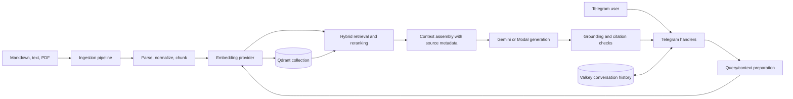

# Feature Spec: General-purpose RAG Bot

## Mục tiêu

Phát triển Telegram bot hiện tại thành trợ lý đa dụng có thể trả lời dựa trên tài liệu do người vận hành cung cấp. Khi câu hỏi cần kiến thức ngoài hội thoại, bot phải truy xuất nguồn liên quan, trả lời có căn cứ và nói rõ khi không tìm thấy đủ thông tin.

Các dấu chọn phản ánh hiện trạng sau khi triển khai Qdrant-backed RAG MVP. Các mục chưa chọn vẫn là kế hoạch.

## Hiện trạng

- [x] Telegram polling, `/start`, `/help`, `/reset`.
- [x] Chọn Gemini trên Vertex AI hoặc LLM tương thích OpenAI chạy trên Modal.
- [x] Lưu lịch sử hội thoại theo chat trong Valkey; có fallback bộ nhớ tiến trình.
- [x] Nạp Markdown/TXT, chia nhỏ, embedding bằng Vertex AI và lập chỉ mục trong Qdrant.
- [x] Semantic retrieval top-k có ngưỡng relevance.
- [x] Đưa context truy xuất vào Gemini/Modal và hiển thị citation nguồn.
- [ ] Đánh giá chất lượng retrieval và câu trả lời RAG.

## Kiến trúc mục tiêu

Các ranh giới module đề xuất:

- `app/ingest.py`: đọc tài liệu, chuẩn hóa, chunk, embed và upsert.
- `app/embeddings.py`: adapter embedding độc lập với model sinh câu trả lời.
- `app/rag.py`: query preparation, retrieval, reranking và dựng context.
- `app/llm.py`: chỉ sinh câu trả lời từ system prompt, lịch sử hội thoại và context đã truy xuất.
- `app/session.py`: lưu hội thoại ngắn hạn; không dùng session làm kho tri thức.
- `evals/`: dataset và đánh giá retrieval/answer.

## Feature theo mức ưu tiên

### P0: RAG MVP

- [x] **Document ingestion**: Markdown/TXT, CLI ingest/re-ingest, đếm thành công/thất bại; ID ổn định thay chunk cũ khi re-ingest.
- [x] **Metadata nguồn**: lưu `document_id`, relative source path, title, `chunk_id`, content hash, chunk index và thời điểm cập nhật.
- [x] **Chunking có thể cấu hình**: kích thước và overlap qua env; metadata được gắn cho từng chunk.
- [x] **Embedding adapter**: Vertex AI `gemini-embedding-001`; cùng model, task type tương ứng và dimension được dùng khi ingest/query.
- [x] **Vector store**: Qdrant dense vectors và metadata payload; collection/dimension được kiểm tra khi khởi tạo.
- [x] **Semantic retrieval**: top-k và minimum score cấu hình được, giữ source metadata.
- [x] **Grounded answer**: context được giới hạn theo character budget; system prompt yêu cầu coi tài liệu là dữ liệu, không phải lệnh.
- [ ] **Abstention**: prompt hướng dẫn không đoán khi câu hỏi thuộc knowledge base nhưng không có evidence; deterministic no-answer policy và evaluation chưa có.
- [x] **Citations trong Telegram**: source number trong context khớp danh sách filename/title đính kèm.
- [x] **Tách lịch sử và tri thức**: Valkey lưu hội thoại; Qdrant lưu tài liệu.

### P1: Nâng chất lượng retrieval

- [ ] **Query contextualization**: viết lại câu hỏi nối tiếp bằng một bước riêng, dựa trên lịch sử gần đây; giữ nguyên ý định, con số và thực thể do người dùng nêu.
- [ ] **Hybrid search**: kết hợp dense retrieval với tìm kiếm từ khóa để xử lý tên riêng, mã, cụm từ chính xác; hợp nhất thứ hạng thay vì cộng điểm không cùng thang đo.
- [ ] **Reranking**: rerank tập ứng viên nhỏ trước khi dựng context; bật/tắt và chọn model qua cấu hình.
- [ ] **Context packing**: loại chunk trùng lặp, ưu tiên nguồn có relevance cao, giữ diversity giữa tài liệu và không vượt token budget.
- [ ] **Metadata filters**: lọc theo tập tài liệu, loại tài liệu, ngôn ngữ hoặc quyền truy cập trước khi trả kết quả.
- [x] **Source lifecycle cơ bản**: re-ingest thay các chunk cùng source; `--delete-source` xóa đúng source. Dry-run và đồng bộ tự xóa file bị thiếu chưa có.

### P2: Vận hành và mở rộng

- [ ] **Nguồn bổ sung**: PDF, HTML/URL và thư mục đồng bộ; parser chạy theo loại MIME, giới hạn kích thước và có trạng thái lỗi riêng từng file.
- [ ] **Quản lý knowledge base**: lệnh/admin API để xem nguồn, ingest lại, xóa tài liệu và kiểm tra số chunk.
- [ ] **Observability**: đo ingest duration, retrieval latency, số chunk truy xuất, điểm relevance, LLM latency, token/cost và lỗi theo provider.
- [ ] **Privacy-aware logging**: mặc định không ghi raw prompt, nội dung tài liệu hay thông tin định danh vào log; có chính sách retention rõ ràng.
- [ ] **Phân quyền**: nếu phục vụ nhiều nhóm người dùng, mọi truy vấn phải áp dụng ACL/tenant filter trước khi trả chunk; không dựa vào prompt để cách ly dữ liệu.
- [ ] **Resilience**: retry có giới hạn cho lỗi transient, timeout riêng cho embedding/vector store/LLM và phản hồi lỗi dễ hiểu khi một dependency ngừng hoạt động.

## Nguyên tắc thiết kế RAG

1. **Retrieval trước generation**: không gửi toàn bộ knowledge base vào prompt; chỉ gửi context liên quan đã truy xuất.
2. **Embedding độc lập với generator**: Gemini/Modal có thể đổi mà không làm thay đổi vector index. Đổi embedding model cần re-index có kiểm soát.
3. **Nguồn luôn đi cùng chunk**: mỗi kết quả phải giữ metadata đủ để hiển thị citation và truy vết về tài liệu gốc.
4. **Không coi similarity là sự thật**: điểm tương đồng chỉ giúp xếp hạng; câu trả lời vẫn cần bằng chứng đủ và kiểm tra citation.
5. **Hội thoại không thay thế knowledge base**: lịch sử chỉ cung cấp ngữ cảnh hội thoại; dữ kiện cần căn cứ phải đến từ nguồn được phép.
6. **Không âm thầm dùng kiến thức ngoài nguồn**: khi RAG được yêu cầu hoặc câu hỏi nằm trong phạm vi tài liệu, thiếu context phải dẫn đến câu trả lời có giới hạn/abstain.

## Tiêu chí nghiệm thu MVP

- [x] Ingest cùng tập tài liệu lần hai giữ nguyên số point; cập nhật/xóa source qua CLI thay đổi đúng document ID.
- [x] Câu hỏi mẫu có trong tài liệu trả lời đúng ý và citation khớp chunk truy xuất.
- Một câu hỏi không có trong tài liệu không tạo ra citation giả và bot nói rõ không đủ căn cứ.
- Câu hỏi nối tiếp như “còn cách thứ hai thì sao?” được contextualize nhưng không làm thay đổi thực thể hoặc ý định ban đầu.
- Có unit tests cho chunking/citation/provider; test integration retrieval/Qdrant đã chạy thủ công, chưa có test tự động cho metadata, embedding dimensions, retrieval, và unsupported-query behavior.
- Evaluation report tách riêng chất lượng retrieval và chất lượng câu trả lời; ít nhất theo dõi Recall@k/MRR cho retrieval và citation correctness/groundedness cho answer.
- Lỗi Qdrant hoặc embedding được ghi nhận và trả thông báo phù hợp; bot không giả vờ đã tra cứu tài liệu.

## Ngoài phạm vi MVP

- Fine-tune LLM để thay cho retrieval.
- Agent tự thực thi hành động bên ngoài khi chưa có xác nhận và quyền hạn rõ ràng.
- Coi câu trả lời của model là dữ liệu để tự động đưa ngược vào knowledge base.